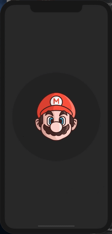
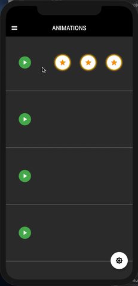
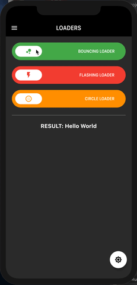

# flutter_playground

Flutter playground project based on BLoC pattern

## Includes
* Animations [[here](https://github.com/Dsazz/flutter_playground/tree/master/lib/screen/home/animation)]
* Audio Player [[example](https://github.com/Dsazz/flutter_playground/blob/master/lib/screen/home/animation/_star_buttons/star_button.dart#L113)]
* BLoC pattern [[here](https://github.com/Dsazz/flutter_playground/tree/master/lib/screen/settings/bloc)]
* Shimmer [[here](https://github.com/Dsazz/flutter_playground/blob/master/lib/util/shimmer.dart)]
* Splash Screen [[library](https://github.com/Dsazz/your_splash)]
* Translations [[here](https://github.com/Dsazz/flutter_playground/tree/master/lib/l10n)]

## Demo

| Splash | Drawer |
| ------------------ | --------------------------- |
|   |   |

| Animations | Loaders | Settings |
| ------------------ | --------------------------- | --------------------------- |
|   |   |   |
