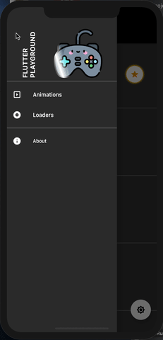

# flutter_playground

 

A new Flutter playground project.

## Demo

| Splash | Drawer |
| ------------------ | --------------------------- |
|   |   |

| Animations | Loaders |
| ------------------ | --------------------------- |
|   |   |
